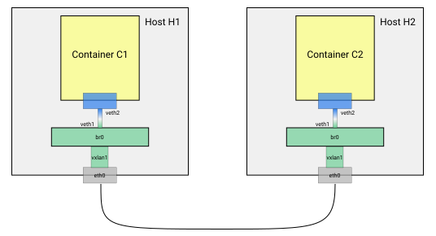
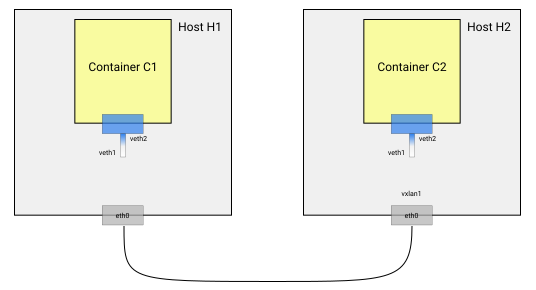
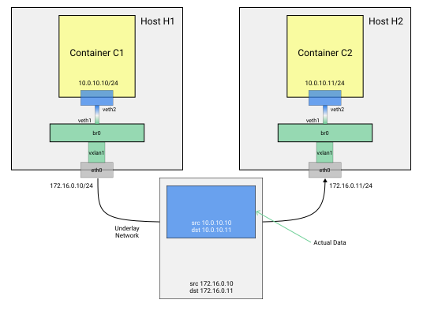

## What we are trying to build

This is the network topology we are trying to create. We are creating an overlay network using VxLAN and Bridge.

<p align="center">
  
</p>

## Command explanations

### 1. Creating the network namespace for the containers.

The following steps are for host1. For host2 we need to replace:
- `10.0.10.10/24` by `10.0.10.11/24`
- `c1_id` by `c2_id`

The steps are:

i. Run the busybox container in detached mode.<br/>
PID 1 is given the command `sleep 60000` so that the  container keeps on running.<br/>
We do not create any network interfaces (except for loopback) in the container.
```sh
docker run -d --net none --name c1 busybox sleep 60000
```

ii.  Create a virtual ethernet pair (veth1, veth2) each supporting max packet size of 1500.
```sh
ip link add dev veth1 mtu 1500 type veth peer name veth2 mtu 1500
```

iii. Grab the process id of the running docker container (which is mapped to pid 1 of the running container).<br/>
We can get container id by running `c1_cid=$(docker inspect --format="{{ .Id }}")`.
```sh
pid=$(docker inspect c1_cid --format '{{.State.Pid}}')
```

iv. Create a link to the namespace of the running container c1 to a host namespace `tmp-ns`.<br/>
This is done because the namespaces of running containers are not visible under `ip netns list`.
```sh
ln -sf /proc/${pid}/ns/net /var/run/netns/tmp-ns
```

v. Attach one endpoint (`veth2`) of the virtual link to `tmp-ns` (the namespace assigned to the container c1)
```sh
ip link set dev veth2 netns tmp-ns
```

vi. Add an IPv4 address to the virtual network interface veth2.
```sh
ip netns exec tmp-ns ip addr add dev veth2 10.0.10.10/24
```

vii. Bring the virtual interface up.<br/>
NOTE: There was a mistake in the question. The command was written as `ip netns exec tmp-ns ip link up veth2` which won't work.

```sh
ip netns exec tmp-ns ip link set veth2 up # NOTE: There was a mistake in the question.
```

After running these commands in both the containers, we crete the <span style="color:#2F80ED">blue part (tmp-ns)</span> of the network topology:

<p align="center">
  
</p>


### 2. Creating the bridge and the VxLan overlay network.

The next step is to create the <span style="color:#6FCF97">green part (my-overlay)</span> of the network topology.

i. Create a new network namespace `my-overlay`.
```sh
ip netns add my-overlay
```

ii. Create a bridge interface in `my-overlay`. A bridge acts like a virtual switch but has an IP address.
```sh
ip netns exec my-overlay ip link add dev br0 type bridge
```

iii. Assign IPv4 address `10.0.10.1/24` to the bridge interface .
```sh
ip netns exec my-overlay ip addr add dev br0 10.0.10.1/24
```

iv. Bring the bridge interface up.
```sh
ip netns exec my-overlay ip link set br0 up
```

v. Create a VxLan interface vxlan1.
```sh
ip link add dev vxlan1 type vxlan id 42 proxy learning dstport 4789
```

- `id 42` : The VxLan Network Identifier Number is 42. All packets forwarded by this VxLan will have this ID.
- `proxy`: The ARP proxy is turned on.
- `learning`: The interface will learn (IP, MAC) address mappings while processing network frames.
- `dstport 4879`: This is the destination port for VxLan. Segments with destination port 4879 will be forwarded to VxLan.

vi. Move the VxLan interface to the `my-overlay` network namespace.
```sh
ip link set vxlan1 netns my-overlay
```

vii. Atttach the VxLan to the bridge we created earlier.
```sh
ip netns exec my-overlay ip link set vxlan1 master br0
```

viii. Bring up the VxLan interface.
```sh
ip netns exec my-overlay ip link set vxlan1 up
```

ix. Bring the other end of the virtual network interface (`veth1`) we created in Step 1.
```sh
ip link set dev veth1 netns my-overlay
```

x. Attach the virtual interface to the bridge.
```sh
ip netns exec my-overlay ip link set veth1 master br0
```

xi. Bring up the virtual interface.
```sh
ip netns exec my-overlay ip link set veth1 up
```

After running all these commands, we have successfully wired up the whole thing.<br/>
However, we won't be able to ping one device from the other because the network `10.0.10.0/24` is situated across another network, i.e., the host's network.

In order to achieve connectivity between all devices in this `10.0.10.0/24` network, we have to teach the interfaces located in the boundary of the network 'sub-segment' (namely the bridge and the VxLan) about the MAC and IP addresses of devices located in the other 'sub-segment'.

### 3. Populating the ARP and FDB

i. We have to teach the vxlan about the ARP mappings for all the devices present in host2. This is because ARP requests don't leave the network (the requests won't leave the host, which sits in a network different from the Bridge br0). Here, we are adding the (IP, MAC) mapping for the interface attached to the container c2.

NOTE: There was a mistake in the question. The IP was mentioned `10.0.10.10` for the comand in host1. However, this IP is already known to the bridge (it's directly attached). The Bridge does not know about the veth IP for the container in the other host machine.
```sh
ip netns exec my-overlay ip neighbor add 10.0.10.11 lladdr $mac_address_of_c2 dev vxlan1
```

ii. The above command alone doesn't work because we haven't yet told the Bridge interface yet how to act when it encounters the unknown MAC address. We also need to teach the bridge interface to add a VxLan header when it encounters a destination MAC address that matches the MAC address of c2 (running in a different host).


```sh
ip netns exec my-overlay bridge fdb add $mac_address_of_c2 dev vxlan1 self dst $ip_address_of_host_running_c2 vni 42 port 4789
```

- `dev vxlan1`: The device that is associated with the MAC address of c2.
- `self`: The operation is fulfilled by VxLan itself.
- `dst $ip_address_of_host_running_c2`: The IP address of the destination VxLan tunnel endpoint from where we will able to reach the specified MAC address.
- `vni 42`: The VxLan Network Identifier Number. This has to match the VNI of the VxLan we created in Step 2.
- `port 4789`: The UDP port on which the remote VxLan tunnel endpoint is listening to.

With this we should achieve full connectivity between containers c1 and c2.<br/>
A packet from c1 to c2 will be forwarded by the external network as shown:

<p align="center">
  
</p>
